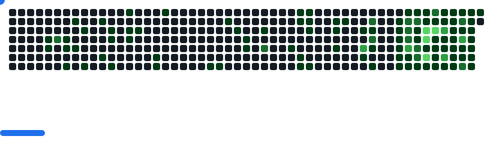

  

###

  
  
  

###

###

<h1 align="center">Wassup 👋, I'm Lark Babao a.k.a @Snorlark</h1>

###

<h3 align="center">Full-Stack Software Engineer | National University Student</h3>

###

  <a href="https://larkbabao-portfolio.vercel.app/" target="_blank">🔗 Visit My Portfolio</a>

###

<h3 align="left">👨‍💻 About Me</h3>

###

  Passionate BSIT student and former Chief Technical Officer of Google Developer Group - NU Manila. Currently a Software Engineering Intern @ MEC Networks Corporation  

  - 🔭 Currently working on **creating Full-Stack Internal Systems for MEC Networks Corporation**
  - 🌱 Learning <strong>Laravel</strong> and advancing my skills in <strong>AI/ML and DevOPS</strong> 
  - 🌱 Current Tech Stack: **React JS, Typescript, MongoDB, NodeJS, Flutter**
  - 👨‍💻 All of my projects are available at my **[Portfolio](https://larkbabao-portfolio.vercel.app/)**
- 📫 Reach me at **larksigmuondbabao@gmail.com**
- 📄 Know about my experiences at my **[Resume](https://babao-lark-resume.tiiny.site/)**

###

<h3 align="left">🛠 Tech Stack</h3>

###

<table>
  <tr>
    <th>Mobile Development</th>
    <th>Web Development</th>
    <th>Backend & Databases</th>
    <th>Tools & Design</th>
  </tr>
  <tr>
    <td align="center">
      
      
      
    </td>
    <td align="center">
      
      
      
      
    </td>
    <td align="center">
      
      
      
      
      
    </td>
    <td align="center">
      
      
      
      
      
      
    </td>
  </tr>
</table>

###

<h3 align="left">📊 GitHub Stats</h3>

###

  
  
  

###

<h3 align="left">🏆 GitHub Trophies</h3>

###

  
  
###

<picture>
  <source
    media="(prefers-color-scheme: dark)"
    srcset="images/breakout-dark.svg"
  />
  <source
    media="(prefers-color-scheme: light)"
    srcset="images/breakout-light.svg"
  />
  
</picture>

