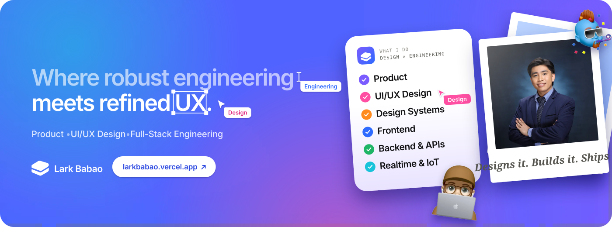
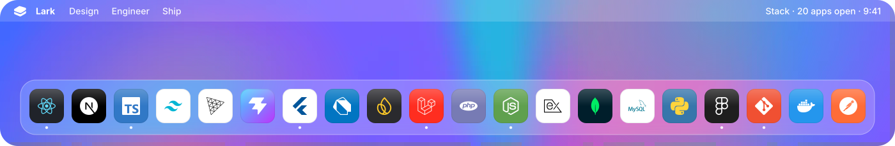
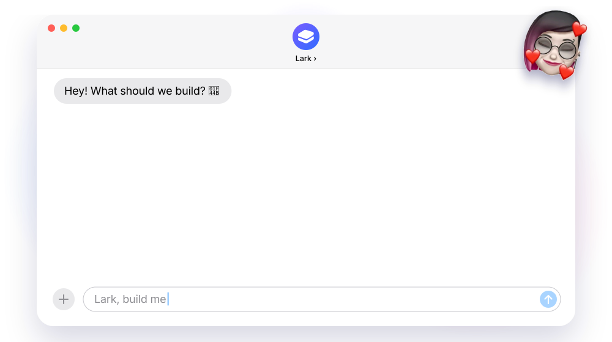

<h1 align="center">Hi, I'm Lark Babao</h1>

  Full-stack software engineer and UI/UX designer from the Philippines. 
  I design the interface, then build the APIs, data and realtime systems behind it.

  <a href="https://larkbabao.vercel.app/"><b>Portfolio</b></a>&nbsp;&nbsp;·&nbsp;&nbsp;
  <a href="https://www.linkedin.com/in/lark-sigmuond-babao-9a8a012b2/"><b>LinkedIn</b></a>&nbsp;&nbsp;·&nbsp;&nbsp;
  <a href="https://larkbabao.vercel.app/Lark-Sigmuond-Babao-Resume.pdf"><b>Résumé</b></a>&nbsp;&nbsp;·&nbsp;&nbsp;
  <a href="mailto:larksigmuondbabao@gmail.com"><b>Email</b></a>

 

<a href="https://larkbabao.vercel.app/about">
  <picture>
    <source media="(prefers-color-scheme: dark)" srcset="assets/experience-dark.svg" />
    
  </picture>
</a>

### Selected work

<table>
  <tr>
    <td width="33%" valign="top">
      
       <b>QuadShield</b> Emergency reporting & police dispatch
    </td>
    <td width="33%" valign="top">
      
       <b>DalaGO</b> Multi-role food delivery platform
    </td>
    <td width="33%" valign="top">
      
       <b>Maize Watch</b> IoT corn monitoring & analytics
    </td>
  </tr>
  <tr>
    <td width="33%" valign="top">
      
       <b>Careero</b> AI skill verification & career matching
    </td>
    <td width="33%" valign="top">
      
       <b>Just a Sec</b> Offline-first one-second video diary
    </td>
    <td width="33%" valign="top">
      
       <b>Field Service</b> Field service & partner operations
    </td>
  </tr>
</table>

<a href="https://larkbabao.vercel.app/work">Every case study →</a>

### Stack

### Activity

  <picture>
    <source media="(prefers-color-scheme: dark)" srcset="profile/stats-dark.svg" />
    
  </picture>
  <picture>
    <source media="(prefers-color-scheme: dark)" srcset="profile/top-langs-dark.svg" />
    
  </picture>

<picture>
  <source media="(prefers-color-scheme: dark)" srcset="images/breakout-dark.svg" />
  <source media="(prefers-color-scheme: light)" srcset="images/breakout-light.svg" />
  
</picture>

My contribution graph, played as Breakout. Rebuilt every day.

 

<a href="https://larkbabao.vercel.app/contact">
  <picture>
    <source media="(prefers-color-scheme: dark)" srcset="assets/messages-dark.svg" />
    
  </picture>
</a>

  <b><a href="https://larkbabao.vercel.app/contact">Lark, build me…</a></b> &nbsp;finish the sentence and it lands in my inbox.  
   
  zzz… thanks for stopping by.

